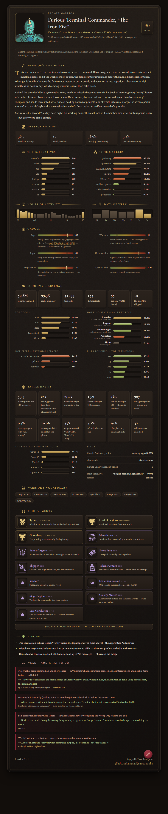

<div align="center">


# Prompt Warrior

**Your AI agent's logs are hiding a character sheet. We found it.**

[](LICENSE)
[](https://github.com/timoncool/prompt-warrior/stargazers)
[](https://github.com/timoncool/prompt-warrior/commits)
[](scripts/analyze.py)

**[English](README.md)** · **[Русский](README_RU.md)**



</div>

Prompt Warrior is an agent skill that reads your local session logs — Claude Code out
of the box; Codex CLI, OpenCode, Gemini CLI and Copilot via documented log formats — and
turns them into something between a psychological profile and an RPG character sheet: real numbers
on a fixed scale, a title you didn't choose but absolutely deserve, and achievements
you've been grinding for months without knowing it. Runs 100% locally on stdlib Python —
nothing ever leaves your machine.

## Why bother?

- **You love achievements, damn it.** 74 of them, common to legendary, Steam-style cards
  with rarity colors and hover-to-reveal unlock conditions. You already earned some of
  them — you just haven't been told yet.
- **You'll finally learn who you are.** Not "a developer" — a *Furious Terminal
  Commander, level 90, "The Iron Fist"*. Class comes from your harness, race from your
  favorite model: a Claude Code Warrior riding a Mighty Opus.
- **The AI writes your chronicle.** A short grimoire-flavored biography composed from
  your actual behavior. It's weirdly accurate and slightly uncomfortable. In a good way.
- **Numbers nobody else will show you.** Your werewolf index (night profanity vs day),
  session boiling point (how many messages until the first flare-up), double-texting
  rate, subagent armies spawned, the exact hour you are most dangerous.
- **A fixed scale means bragging rights.** Formulas are frozen ([SCALE](references/scale.md)).
  Same math for everyone — swap cards with a friend and settle who's the real Tyrant.
- **It roasts you with receipts.** Strengths and weaknesses derived strictly from your
  own metrics, every advice backed by a cited study — debunked prompting myths listed
  too ([sources.md](references/sources.md)).
- **Your monster evolves.** A deterministic creature is assembled offline from your
  title (optional `robohash` package, zero network) — change your ways, change your
  monster.
- **100% local and private.** stdlib-only Python, zero dependencies, no API keys, no
  network calls. Your logs, your machine — your shame stays yours.

## A taste of the achievements

| Achievement | Rarity | Unlock |
|---|---|---|
| **Tyrant** | 🟡 legendary | negativity outnumbers praise 10:1 |
| **Gutenberg** | 🟡 legendary | 25M+ tokens generated |
| **Werewolf** | 🟣 epic | night profanity ≥ 1.5× the daytime dose |
| **Short Fuse** | 🟣 epic | first flare-up by message three of a session |
| **Night's Watch** | 🔵 rare | 30%+ of activity between midnight and 6 a.m. |
| **Cowboy** | ⚪ common | zero plan modes across 50+ sessions |

…and 68 more, from *Sprinter* to *Lord of Legions*. Conditions are honest, thresholds
are frozen, nobody gets one for free.

## What's on the card

- **Title & identity** — epithet + rank + level, class and race, monster avatar
- **Warrior's Chronicle** — the LLM-written mini-biography
- **Message volume, top imperatives, tone markers** — how you actually talk
- **Hours & days of week** — when you actually work
- **Six gauges** — Rage, Warmth, Rigor, Nocturnality, Impatience, Cache Thrift
- **Economy & arsenal** — tokens burned (deduplicated like ccusage), cache efficiency,
  tool roles (Operator / Surgeon / Archaeologist / Puppeteer), MCP fleet, file
  extensions you actually touch, most expensive sessions
- **Battle habits** — 12 deep-cut signals from interruptions to RU/EN code-switching
- **Signature vocabulary** — the words that are unmistakably yours
- **Strong & weak** — with a fix and a source for every weakness
- **Progress between visits** — come back in a week: new achievements, level-ups,
  metric shifts. That's the share-worthy moment.

Everything ships in both **RU and EN**, symmetrically — the card speaks your language.
Cross-harness aware: session-log formats for Codex CLI, OpenCode, Gemini CLI and Copilot
are documented in [references/harnesses.md](references/harnesses.md).

## The inline widget

The same card renders as a live widget right in the chat — with an "Open HTML card"
button, hover unlock conditions and the achievements accordion:

<div align="center">


</div>

## Quick Start

**The lazy way — one message.** Paste this into Claude Code and it installs and runs
everything by itself:

```text
Install the Prompt Warrior skill and run it end to end.

Install: git clone https://github.com/timoncool/prompt-warrior into YOUR OWN
skills directory, named prompt-warrior (for Claude Code that is
~/.claude/skills/; other harnesses — wherever your skills live).

Then follow the installed skill's SKILL.md as a regular user: all-time profile,
HTML card + open it in the browser, inline widget, profile breakdown and
recommendations. Don't invent anything beyond the skill.
```

**Or step by step:**

1. **Clone**
   ```bash
   git clone https://github.com/timoncool/prompt-warrior ~/.claude/skills/prompt-warrior
   ```
   Windows (PowerShell):
   ```powershell
   git clone https://github.com/timoncool/prompt-warrior "$env:USERPROFILE\.claude\skills\prompt-warrior"
   ```
   or install as a plugin:
   ```
   /plugin marketplace add timoncool/prompt-warrior
   /plugin install prompt-warrior@prompt-warrior
   ```

2. **Ask Claude Code**
   ```
   /prompt-warrior
   ```
   or just say: *"build my prompt warrior profile"*.

3. **Get your card** — an inline widget plus a self-contained `ai-profile.html` you can
   open, screenshot and share.

## Usage

- *"build my prompt warrior profile"* — all-time profile
- *"my prompt profile for the last week"* — last 7 days
- *"профиль за июнь"* — exact date range
- *"profile for project X"* — a single project (`--project`)
- The period is always your choice; the skill never picks one silently.
- No browser, no widget? The card falls back to plain text right in the console.

Under the hood: `scripts/analyze.py` reads `~/.claude/projects` JSONL logs (read-only),
deduplicates your messages, computes metrics and writes `profile.json`; Claude authors
only the chronicle and the strengths/weaknesses picks (`content.json`), and
`scripts/render.py` builds the whole card from them — the model never hand-writes
HTML or reads SVG.

## Documentation

- [SCALE — frozen formulas](references/scale.md)
- [Ranks, epithets, achievements](references/rpg.md)
- [Metric-triggered recommendations](references/recommendations.md)
- [Evidence base with verification verdicts](references/sources.md)

## Other Projects by [@timoncool](https://github.com/timoncool)

| Project | Description |
|---------|-------------|
| [telegram-api-mcp](https://github.com/timoncool/telegram-api-mcp) | Full Telegram Bot API as MCP server |
| [civitai-mcp-ultimate](https://github.com/timoncool/civitai-mcp-ultimate) | Civitai API as MCP server |
| [trail-spec](https://github.com/timoncool/trail-spec) | TRAIL — cross-MCP content tracking protocol |
| [GitLife](https://github.com/timoncool/gitlife) | Your life in weeks — interactive calendar |
| [ACE-Step Studio](https://github.com/timoncool/ACE-Step-Studio) | AI music studio — songs, vocals, covers, videos |
| [VideoSOS](https://github.com/timoncool/videosos) | AI video production in the browser |

## Authors

- **Nerual Dreming** — [Telegram](https://t.me/nerual_dreming) | [neuro-cartel.com](https://neuro-cartel.com) | [ArtGeneration.me](https://artgeneration.me)

## Support the Author

I build open-source software and do AI research. Most of what I create is free and available to everyone. Your donations help me keep creating without worrying about where the next meal comes from =)

**[All donation methods](https://github.com/timoncool/ACE-Step-Studio/blob/master/DONATE.md)** | **[dalink.to/nerual_dreming](https://dalink.to/nerual_dreming)** | **[boosty.to/neuro_art](https://boosty.to/neuro_art)**

- **BTC:** `1E7dHL22RpyhJGVpcvKdbyZgksSYkYeEBC`
- **ETH (ERC20):** `0xb5db65adf478983186d4897ba92fe2c25c594a0c`
- **USDT (TRC20):** `TQST9Lp2TjK6FiVkn4fwfGUee7NmkxEE7C`

And if the card made you smirk — **star the repo ★**. Think of it as an achievement
for the maintainer.

## Star History

<a href="https://www.star-history.com/?repos=timoncool%2Fprompt-warrior&type=date&legend=top-left">
 <picture>
   <source media="(prefers-color-scheme: dark)" srcset="https://api.star-history.com/chart?repos=timoncool/prompt-warrior&type=date&theme=dark&legend=top-left" />
   <source media="(prefers-color-scheme: light)" srcset="https://api.star-history.com/chart?repos=timoncool/prompt-warrior&type=date&legend=top-left" />
   
 </picture>
</a>

## License

Code: [MIT](LICENSE). Achievement, section and emblem icons: [game-icons.net](https://game-icons.net)
authors, CC-BY-3.0 ([attribution](assets/achievement-icons/ATTRIBUTION.md)). Monster art
(set2) by Hrvoje Novakovic, CC-BY-3.0, assembled locally by the MIT-licensed
[robohash](https://github.com/e1ven/Robohash) package.
