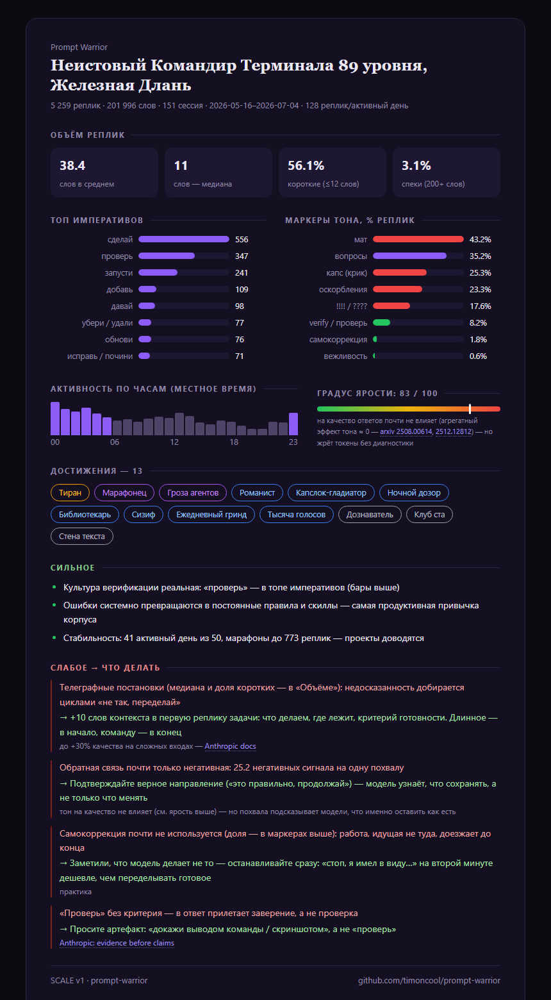

<div align="center">


# Prompt Warrior

**В логах твоего ИИ-агента спрятан лист персонажа. Мы его нашли.**

[](LICENSE)
[](https://github.com/timoncool/prompt-warrior/stargazers)
[](https://github.com/timoncool/prompt-warrior/commits)
[](scripts/analyze.py)

**[English](README.md)** · **[Русский](README_RU.md)**



</div>

Prompt Warrior — агентский скилл, который читает локальные логи сессий — Claude Code
из коробки; Codex CLI, OpenCode, Gemini CLI и Copilot по задокументированным форматам —
и превращает их в нечто среднее между психологическим портретом и RPG-листом персонажа:
реальные цифры по фиксированной шкале, титул, который вы не выбирали, но точно
заслужили, и ачивки, которые вы месяцами фармили, сами того не зная. Работает полностью
локально на stdlib Python — наружу не уходит ничего.

## Зачем это вам?

- **Вы же любите ачивки, чёрт возьми!** 74 штуки, от common до legendary, стим-стайл
  карточки с цветами редкости и условиями по ховеру. Часть вы уже выбили — вам просто
  ещё не сказали.
- **Наконец узнаете, кто вы.** Не «разработчик», а *Неистовый Командир Терминала
  90 уровня, «Железная Длань»*. Класс — от харнесса, раса — от любимой модели:
  Воин Claude Code верхом на Могучем Опусе.
- **ИИ напишет вашу хронику.** Короткая биография в тоне летописи, составленная по
  вашему реальному поведению. Пугающе точная и слегка неловкая. В хорошем смысле.
- **Цифры, которых вам больше никто не покажет.** Индекс оборотня (ночной мат против
  дневного), точка кипения сессий (на какой реплике первая вспышка), частота
  дабл-текстов, армии субагентов, час суток, в который вы наиболее опасны.
- **Фиксированная шкала = законный повод меряться.** Формулы заморожены
  ([SCALE](references/scale.md)). Математика одна на всех — обменяйтесь карточками
  с другом и выясните, кто тут настоящий Тиран.
- **Прожаривает с пруфами.** Сильное и слабое строго из ваших метрик, каждый совет
  подкреплён исследованием — развенчанные мифы промптинга тоже перечислены
  ([sources.md](references/sources.md)).
- **Ваш монстр эволюционирует.** Детерминированное существо собирается офлайн из
  вашего титула (опциональный пакет `robohash`, ноль сети) — изменитесь вы,
  изменится и монстр.
- **100% локально и приватно.** Только stdlib Python, ноль зависимостей, без ключей
  и сетевых вызовов. Ваши логи, ваша машина — ваш позор остаётся при вас.

## Дегустация ачивок

| Ачивка | Редкость | Условие |
|---|---|---|
| **Тиран** | 🟡 legendary | негатива в 10 раз больше, чем похвалы |
| **Гутенберг** | 🟡 legendary | 25+ млн токенов сгенерировано |
| **Оборотень** | 🟣 epic | ночной мат ≥ 1.5× дневной дозы |
| **Короткий фитиль** | 🟣 epic | первая вспышка — к третьей реплике сессии |
| **Ночной дозор** | 🔵 rare | 30%+ активности между полуночью и шестью утра |
| **Ковбой** | ⚪ common | ноль план-режимов за 50+ сессий |

…и ещё 68, от *Спринтера* до *Владыки легионов*. Условия честные, пороги заморожены,
даром не даётся ни одна.

## Что на карточке

- **Титул и идентичность** — эпитет + звание + уровень, класс и раса, монстр-аватар
- **Хроника воина** — мини-биография, написанная ЛЛМ
- **Объём реплик, топ императивов, маркеры тона** — как вы разговариваете на самом деле
- **Часы и дни недели** — когда вы на самом деле работаете
- **Шесть шкал** — Ярость, Теплота, Дотошность, Совиность, Нетерпеливость, Кэш-скряга
- **Экономика и арсенал** — токены (с дедупом как в ccusage), кэш-эффективность, роли
  инструментов (Оператор / Хирург / Археолог / Кукловод), MCP-парк, расширения файлов,
  самые дорогие сессии
- **Боевые повадки** — 12 глубоких сигналов, от прерываний до RU/EN код-свитчинга
- **Фирменный словарь** — слова, по которым вас узнают без подписи
- **Сильное и слабое** — к каждой слабости фикс и источник
- **Прогресс между визитами** — вернитесь через неделю: новые ачивки, левел-апы,
  сдвиги метрик. Тот самый момент для скриншота.

Всё выходит на **RU и EN** симметрично — карточка говорит на вашем языке.
Кросс-харнесс: форматы логов Codex CLI, OpenCode, Gemini CLI и Copilot задокументированы
в [references/harnesses.md](references/harnesses.md).

## Инлайн-виджет

Та же карточка рендерится живым виджетом прямо в чате — с кнопкой «Открыть HTML-карточку»,
условиями ачивок по ховеру и аккордеоном достижений:

<div align="center">


</div>

## Быстрый старт

**Ленивый вариант — одно сообщение.** Вставь это в Claude Code целиком — он сам всё
установит и прогонит:

```text
Установи скилл Prompt Warrior с гитхаба и сразу прогони его по полной.

Установка:
git clone https://github.com/timoncool/prompt-warrior "$env:USERPROFILE\.claude\skills\prompt-warrior"
(Linux/macOS: git clone https://github.com/timoncool/prompt-warrior ~/.claude/skills/prompt-warrior)

Дальше следуй SKILL.md установленного скилла как обычный пользователь:
профиль за всё время, HTML-карточка + открой её в браузере,
инлайн-виджет, разбор профиля и рекомендации.
Ничего не изобретай сверх скилла.
```

**Или по шагам:**

1. **Клонировать**
   ```powershell
   git clone https://github.com/timoncool/prompt-warrior "$env:USERPROFILE\.claude\skills\prompt-warrior"
   ```
   Linux/macOS:
   ```bash
   git clone https://github.com/timoncool/prompt-warrior ~/.claude/skills/prompt-warrior
   ```
   или установить как плагин:
   ```
   /plugin marketplace add timoncool/prompt-warrior
   /plugin install prompt-warrior@prompt-warrior
   ```

2. **Попросить Claude Code**
   ```
   /prompt-warrior
   ```
   или просто: *«построй мой промпт-профиль»*.

3. **Получить карточку** — инлайн-виджет плюс автономный `ai-profile.html`, который
   можно открыть, заскринить и зашарить.

## Использование

- *«построй мой промпт-профиль»* — за всё время
- *«профиль за последнюю неделю»* — последние 7 дней
- *«профиль за июнь»* — точный диапазон дат
- *«профиль по проекту X»* — один проект (`--project`)
- Период — всегда ваш выбор; скилл никогда не решает за вас молча.
- Нет браузера и виджета? Карточка выведется текстом прямо в консоль.

Под капотом: `scripts/analyze.py` читает JSONL-логи из `~/.claude/projects` (только
чтение), дедуплицирует ваши реплики, считает метрики и пишет `profile.json`; Claude
пишет только хронику и выбор сильного/слабого (`content.json`), а всю карточку из них
собирает `scripts/render.py` — модель не пишет HTML руками и не читает SVG.

## Документация

- [SCALE — замороженные формулы](references/scale.md)
- [Звания, эпитеты, ачивки](references/rpg.md)
- [Рекомендации по триггерам метрик](references/recommendations.md)
- [База источников с вердиктами проверки](references/sources.md)

## Другие проекты [@timoncool](https://github.com/timoncool)

| Проект | Описание |
|--------|----------|
| [telegram-api-mcp](https://github.com/timoncool/telegram-api-mcp) | Telegram Bot API как MCP-сервер |
| [civitai-mcp-ultimate](https://github.com/timoncool/civitai-mcp-ultimate) | Civitai API как MCP-сервер |
| [trail-spec](https://github.com/timoncool/trail-spec) | TRAIL — протокол трекинга контента |
| [GitLife](https://github.com/timoncool/gitlife) | Жизнь в неделях — интерактивный календарь |
| [ACE-Step Studio](https://github.com/timoncool/ACE-Step-Studio) | AI-студия музыки — песни, вокал, каверы, клипы |
| [VideoSOS](https://github.com/timoncool/videosos) | AI-видеопродакшн в браузере |

## Авторы

- **Nerual Dreming** — [Telegram](https://t.me/nerual_dreming) | [neuro-cartel.com](https://neuro-cartel.com) | [ArtGeneration.me](https://artgeneration.me)

## Поддержать автора

Я создаю опенсорс софт и занимаюсь исследованиями в области ИИ. Большая часть всего, что я делаю, находится в открытом доступе. Ваши пожертвования позволяют мне создавать и исследовать больше, не отвлекаясь на поиск еды для продолжения существования =)

**[Все способы поддержки](https://github.com/timoncool/ACE-Step-Studio/blob/master/DONATE.md)** | **[dalink.to/nerual_dreming](https://dalink.to/nerual_dreming)** | **[boosty.to/neuro_art](https://boosty.to/neuro_art)**

- **BTC:** `1E7dHL22RpyhJGVpcvKdbyZgksSYkYeEBC`
- **ETH (ERC20):** `0xb5db65adf478983186d4897ba92fe2c25c594a0c`
- **USDT (TRC20):** `TQST9Lp2TjK6FiVkn4fwfGUee7NmkxEE7C`

А если карточка заставила ухмыльнуться — **поставьте звезду ★**. Считайте это
ачивкой для мейнтейнера.

## Star History

<a href="https://www.star-history.com/?repos=timoncool%2Fprompt-warrior&type=date&legend=top-left">
 <picture>
   <source media="(prefers-color-scheme: dark)" srcset="https://api.star-history.com/svg?repos=timoncool/prompt-warrior&type=date&theme=dark&legend=top-left" />
   <source media="(prefers-color-scheme: light)" srcset="https://api.star-history.com/svg?repos=timoncool/prompt-warrior&type=date&legend=top-left" />
   
 </picture>
</a>

## Лицензия

Код: [MIT](LICENSE). Иконки ачивок, секций и эмблемы: авторы [game-icons.net](https://game-icons.net),
CC-BY-3.0 ([атрибуция](assets/achievement-icons/ATTRIBUTION.md)). Арт монстров (set2) —
Hrvoje Novakovic, CC-BY-3.0, собирается локально MIT-пакетом
[robohash](https://github.com/e1ven/Robohash).
